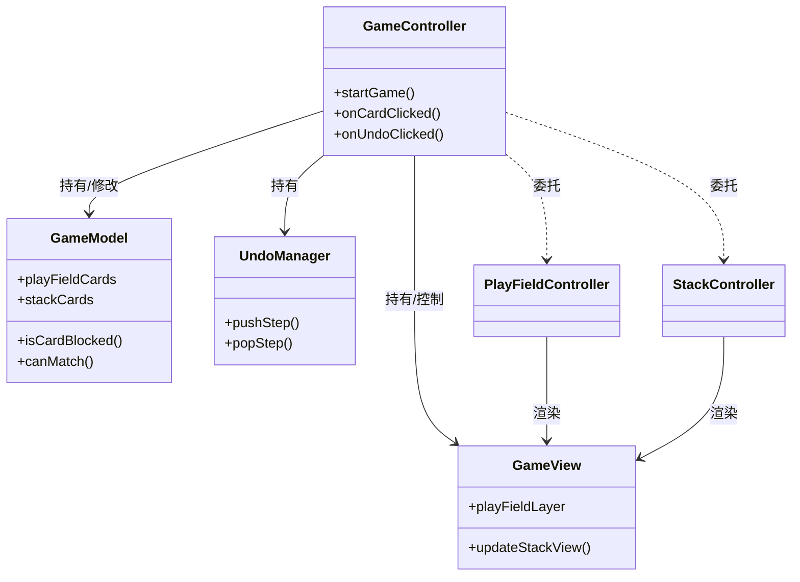

# CardMatch 程序设计架构文档

## 1. 设计综述 (Executive Summary)

本项目尝试采用 **MVC (Model-View-Controller)** 分层架构，旨在构建一个**低耦合、高内聚、易于扩展**的卡牌游戏框架。设计过程中重点考虑以下方向：

1.  **数据驱动 (Data-Driven)**：关卡布局与卡牌属性通过配置定义，降低硬编码依赖。
2.  **几何逻辑 (Geometric Logic)**：摒弃传统的网格系统，采用 2D 空间几何关系（遮挡算法）处理游戏逻辑，极大地提升了玩法的自由度和布局的灵活性。
3.  **单向依赖 (Unidirectional Dependency)**：明确`Controller` -> `Model` -> `View` (通过回调)的单向流，减少模块耦合

---

## 2. 系统架构详细设计

### 2.1 模块职责划分

| 层级 | 模块名称 | 职责描述 | 关键类 |
| :--- | :--- | :--- | :--- |
| **Model** | **数据核心** | 负责业务数据的存储、状态判定、规则计算。不依赖任何 UI 组件。 | `GameModel`<br>`CardModel` |
| **View** | **视图表现** | 负责界面渲染、动画播放、用户输入捕获。只负责“显示”，不处理“为什么显示”。 | `GameView`<br>`CardView` |
| **Controller** | **业务控制** | 负责由输入触发的业务流程、协调 Model 更新、驱动 View 刷新。 | `GameController`<br>`PlayFieldController`<br>`StackController` |
| **Service** | **基础服务** | 提供无状态的通用功能，如配置加载、资源路径生成、数据生成。 | `LevelConfigLoader`<br>`GameModelGenerator` |
| **Manager** | **状态管理** | 负责特定子系统的复杂状态管理。 | `UndoManager` |

### 2.2 类图关系简述



---

## 3. 核心机制实现

### 3.1 几何遮挡系统 (Geometric Occlusion System)
- **实现位置**: `GameModel::isCardBlocked`
- **算法**:
  1. 计算目标卡牌的 AABB (Axis-Aligned Bounding Box)，缩放至 70% 以优化手感。
  2. 遍历所有 Y 坐标更小（即位于更上层）的卡牌。
  3. 若发生矩形相交，则判定被遮挡。
- **优势**: 支持任意形状的摆法（金字塔、圆形、散乱堆叠），无需修改代码即可通过 JSON 配置新关卡。

### 3.2 撤销系统 (Command Pattern based Undo)
采用简化的命令模式思想，记录状态快照。
- **数据结构**: `UndoStep` 结构体记录了“谁(Card)”、“从哪来(OriginalPos)”、“当时的底牌(PrevTop)”。
- **流程**:
  1. 操作发生前 -> 捕获当前上下文。
  2. `pushStep` 入栈。
  3. 撤销时 -> `popStep` -> 逆向恢复数据 -> 强制刷新视图。

---

## 4. 扩展开发 (Extensibility )

本章节详细说明在当前架构下，如何应对未来的功能扩展需求。

### 场景 A：需新增一种特殊卡牌（例如：“万能牌 Joker”）

**设计思路**：利用 `CardModel` 的类型系统和 `GameModel` 的规则系统进行扩展，无需重写核心逻辑。

1.  **定义类型 (Configs)**
    *   在 `GameConstants.h` 的 `CardFaceType` 枚举中添加 `CFT_JOKER`。
    *   或者引入新的枚举 `CardType { NORMAL, JOKER }`。

2.  **更新数据模型 (Model)**
    *   `CardModel`: 无需修改结构，只需在初始化时支持 Joker 类型。
    *   `GameModel::canMatch(cardA, cardB)`: 修改匹配规则。
        ```cpp
        // 伪代码示例
        if (cardA->getFace() == CFT_JOKER || cardB->getFace() == CFT_JOKER) return true;
        // ... 原有逻辑
        ```

3.  **更新视图表现 (View)**
    *   `CardHelper::getCardFrameName`: 增加 Joker 图片的路径映射。
    *   `CardView`: 如果 Joker 不需要显示数字和花色，在 `initWithCardModel` 中根据类型隐藏 `_numberTop` 和 `_suitSprite`。

4.  **配置支持 (Service)**
    *   修改 `level1.json` 格式或解析器 `LevelConfigLoader`，允许配置 Joker 卡牌。

---

### 场景 B：需新增一种回退功能（例如：回退“洗牌道具”的操作）

**设计思路**：当前的 `UndoManager` 记录的是结构体，为支持多态行为，可采用 **Type Tag** 或 **继承** 方式。

1.  **扩展回退数据结构 (Manager)**
    *   在 `UndoManager.h` 中定义操作类型：
        ```cpp
        enum class UndoActionType { MOVE_CARD, DRAW_STOCK, USE_ITEM_SHUFFLE };
        ```
    *   修改 `UndoStep` 结构体，增加 `type` 字段和数据联合体（或 `std::any` / `void*` 数据负载），用于存储洗牌前的卡牌顺序快照。

2.  **记录操作 (Controller)**
    *   在 `GameController::onShuffleClicked()` 中：
        ```cpp
        std::vector<int> cardOrderSnapshot = _gameModel->getCardOrderSnapshot();
        _undoManager->pushShuffleStep(cardOrderSnapshot); // 记录洗牌前的顺序
        _gameModel->shuffle();
        ```

3.  **执行回退 (Controller)**
    *   在 `GameController::onUndoClicked()` 中增加分发逻辑：
        ```cpp
        UndoStep step = _undoManager->pop();
        switch (step.type) {
            case MOVE_CARD: handleUndoMove(step); break;
            case DRAW_STOCK: handleUndoDraw(step); break;
            case USE_ITEM_SHUFFLE: 
                _gameModel->restoreCardOrder(step.shuffleData); // 恢复顺序
                _playFieldController->renderPlayField(); // 重新渲染
                break;
        }
        ```

---

## 5. 项目总结

1.  **高可维护性**：
    *   所有的游戏规则集中在 `GameModel`，修改规则不需要触碰 UI 代码。
    *   所有的视图逻辑集中在 `View`，更换美术资源或特效不需要担心破坏游戏逻辑。
2.  **高可扩展性**：
    *   通过 JSON 配置即可生产成百上千个不同关卡。
    *   通过上述扩展指南，可以轻松接入道具系统、技能系统或新卡牌类型。


这套架构具备后续承接更复杂卡牌玩法（如 Solitaire, Spider, FreeCell 等）的基础能力。
